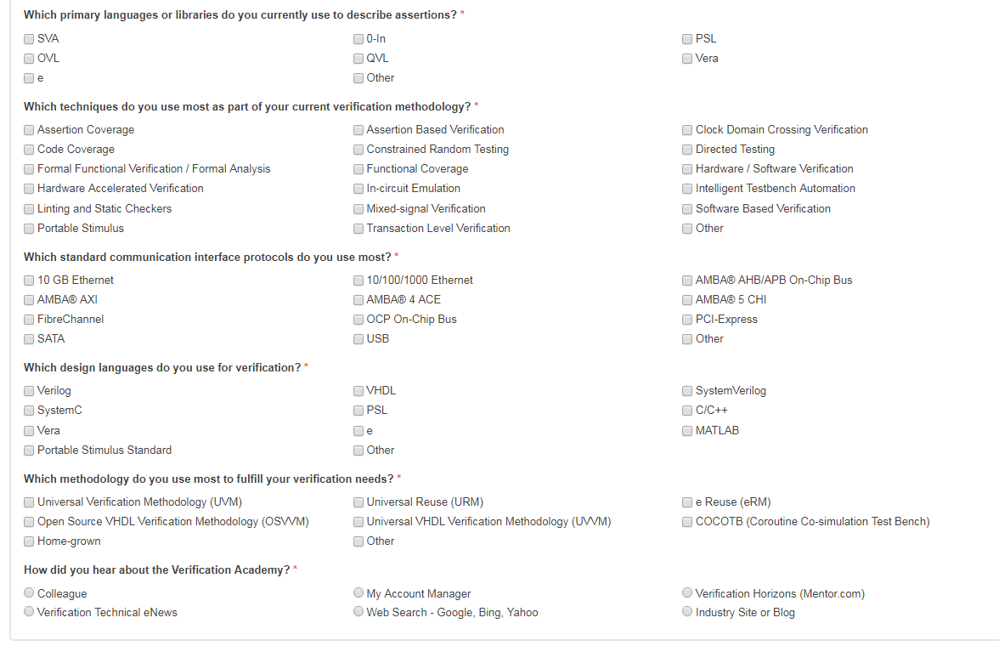
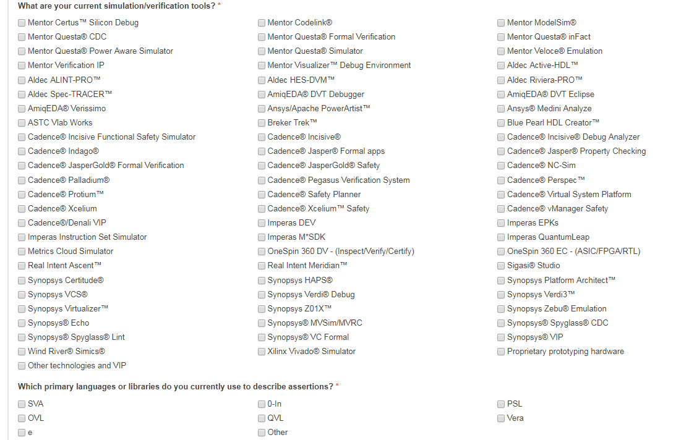

# Güncel Doğrulama Yöntemleri

Mentor'a ait [Verification Academy](https://verificationacademy.com/)
sitesine üye olurken sorduğu birçok soru vardı. Bu sorulardan güncel FPGA veya
ASIC doğrulama araçlarını, yöntemlerini görmek mümkün diye ekran görüntülerini
aldım. Kayıt olması için aşağıya koyuyorum. 10 Şubat 2020'de almışım.

