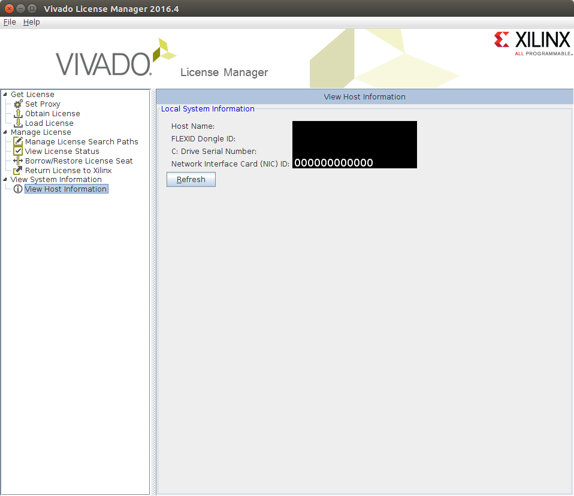

# Vivado 2016.4 Node Locked License Not Working on Ubuntu 16.04 (215-2-04650177)

## Symptoms

There are two Vivado versions on my Ubuntu 16.04(.6) machine: 2016.4 and 2018.1. I use node locked license, `.lic` file. License works fine with 2018.1. However when I check Vivado License Manager 2016.4, I see that `Host IDs Match` under `Manage License` → `View License Status` isn’t `Yes`. This field is `Yes` in Vivado License Manager 2018.1. Therefore, the `.lic` file should be working.

## Diagnosis

Versions of license manager used in 2016.4 and 2018.1 are different. Node locked license is locked on MAC address of the ethernet card. Modern Linux distributions like Ubuntu 16.04 enumerate ethernet cards similar to `enpXsY` whereas old systems use `ethX` format. License manager of 2016.4 can only detect old formatted cards and in this case it can’t read MAC address. As illustrated below, MAC address is read full of 0s.



## Solution

One possible solution is enforcing Ubuntu to name the ethernet card in ethX format. I created a udev rule. Create the following rule in `/etc/udev/rules.d/70-persistent-net.rules`. You should replace `02:01:02:03:04:05` with your MAC address (hint: use `ifconfig` to find).

```text
SUBSYSTEM=="net", ACTION=="add", DRIVERS=="?*", ATTR{address}=="02:01:02:03:04:05", ATTR{dev_id}=="0x0", ATTR{type}=="1", NAME="eth0"
```

After restart, check the name of the card with `ifconfig` command. Name should be `eth0` and you should have licensed Vivado 2016.4.

## Ref

* [1](https://www.xilinx.com/support/answers/60510.html)
* [2](https://askubuntu.com/a/785442)
