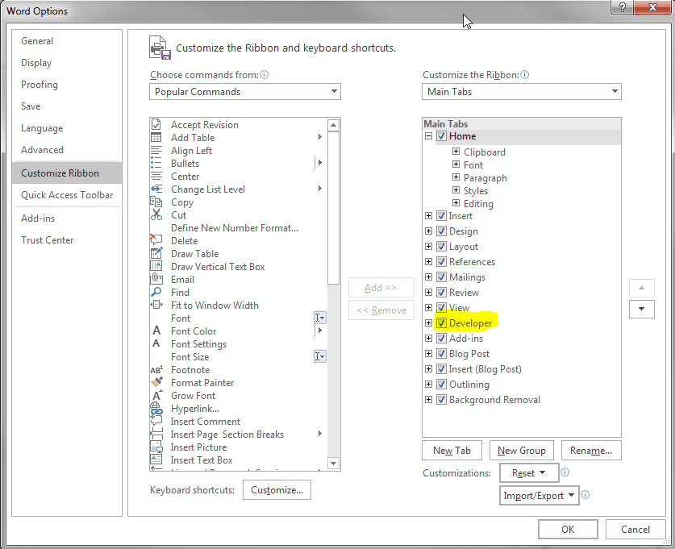
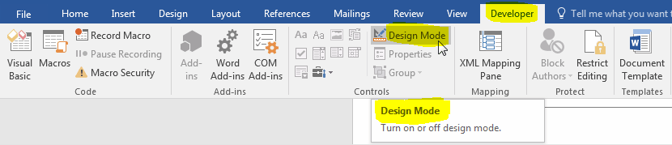

# "You can't make this change because this selection is locked." Microsoft Word Solution (215-2-36917626)

For some **stupid** reason, you may be required to write a **stupid** Word document
by editing a **stupid** `.dotx` template. Even you are *supposed to change*
some part of the **stupid** template, you may get the following **stupid** error:

`You can't make this change because this selection is locked.`

There are several proposed solution for this **stupid** problem but only one
of them worked for me. [^1]

1. If your Word is missing `Developer` tab at the top, first go to `Options` → `Customize Ribbon`.
    and enable the `Developer` option.

    

2. Then click `Design Mode` to remove the **stupid** restriction.
    

3. Thank LaTeX developers.

[^1]: [The solution worked for me](https://answers.microsoft.com/en-us/msoffice/forum/all/microsoft-word-message-you-cant-make-this-change/341971aa-ec61-4984-8af2-105c2032bb56)
