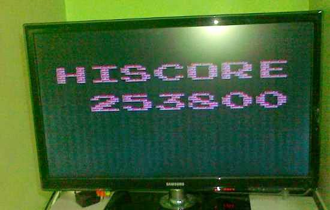
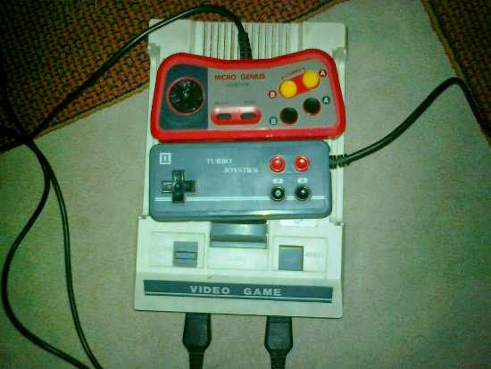
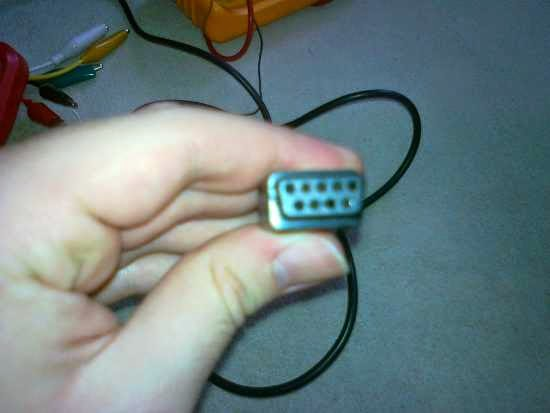
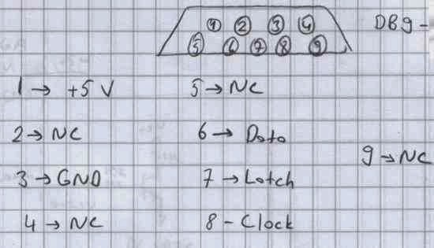
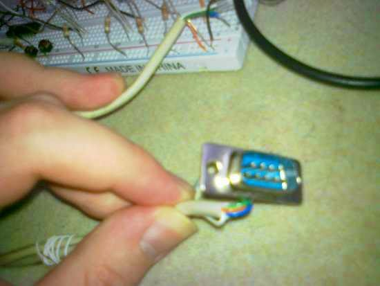
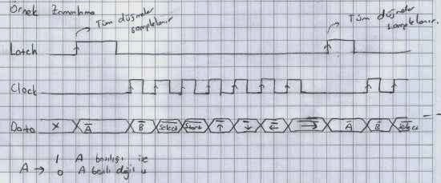

# Atari Kolu (NES Controller) Arayüzü (215-2-13197405)

Benim yaşımdakiler için herhalde çocukluğunda atari ile karşılaşmamış kişi pek yoktur. Atari ismi bildiğim kadarı ile Atari firmasının ürettiği bir "oyun makinası" ile genelleşmiş bir isim olmuştur. Benim gibi hala vakit bulduğu zaman atari oynayan var mıdır bilmiyorum. Fakat bana tüm bilgisayar oyunlarından daha zevkli gelmektedir. Özellikle babamla beraber oynadığım meşhur **Tank 90** oyununun yeri başkadır. Rekor skorumuz olan **253800**’ü Eylül 2011 ayında yapmış bulunmaktayız. Elbet ki daha yüksek yapanlar vardır fakat biz bayağı emek verdik bu skora çıkmak için. :) Rekorumuzun fotoğrafı da aşağıda:



*Tank oyununda babam ile yaptığımız rekor.*

Bendeki atari şu şekilde:



*Emektar Atarim*

Alttaki gri kol, atarinin içerisinden çıkan kol. Üstteki kırmızı, Micro Genius kolu orijinal kolların kabloları bir süre sonra temassızlık yapıp, çalışmayınca almıştım. Atarimin orijinal adı internetten bulduğum kadarı ile Famicom firmasının ürettiği Family Computer. Galiba çoğu kişideki atariden farkı kaset olmadan da kendi içinde Tank 90 gibi oyunlar barındırması. Bu yüzden zamanında sadece 2 adet atari kasetim olmuştu. Birini de küçükken bir arkadaş alıp, geri vermeyince elimde bir tane kaldı. :D

Atari anılarımızı tazeledikten sonra gelelim yazının asıl konusuna. Bu yazıda elimden geldiğince bir atari kolunun, daha doğru adı ile "NES (Nintendo Entertainment System) Controller"ın nasıl çalıştığını ve bu aleti atari dışında, kendi yaptığımız devreler gibi yerlerde nasıl kullanabileceğimizi anlatmaya çalışacağım.

Atari kolunda toplamda 8 adet düğme bulunmaktadır: Yukarı, Aşağı, Sağa, Sola, A, B, Start ve Select. Yukarıdaki fotoğrafta da görebileceğiniz gibi iki adet de Turbo tuşu bulunmaktadır. Yani toplamda kol üzerinde 10 adet düğme vardır. Peki neden 8 düğme var diyorsun derseniz nedeni de şudur: Turbo A, A tuşu ile Turbo B ise B tuşu ile atariye aynı sinyali göndermektedir. Yani atari tarafında Turbo A ile A’nın ve Turbo B ile B’nin bir farkı yok. Fakat, örneğin nasıl oluyor da A ile bir kez ateş edip, Turbo A ile sürekli ateş ediyoruz derseniz o da anladığım kadarı ile şöyle oluyor: Burada sürekli ateş etmeyi sağlayan şey aslında kumanda. Biz A’ya basıp, basılı tuttuğumuzda atari sürekli A’ya basılıyor diyor ve elimizi çekip, tekrar basana kadar yeni bir atış yaptırtmıyor. Tabi bu oyundan oyuna değişebilir. Fakat Turbo tuşlarına bastığımız zaman her ne kadar biz tuşa basılı tutsak da, atari kolu içerisindeki devre bizim yerimize A tuşuna sürekli basıp, çekiyor. Böylece Turbo A’yı basılı tutmak, A tuşuna elimizle sürekli basıp çekmeye eşdeğer oluyor. Kumanda ile uğraşırken ilk başta hep 10 ayrı tuş var diye düşünüyordum ve internetteki kaynaklarda bu kolların 8 tuşlu ve 16 tuşlu versiyonların bulunduğunu okuduğumdan, ben 16 tuşlu kumanda devresi olduğunu sanıyordum ve buna başlarda zaman kaybettirdi. Çünkü iki tip kumandanın sinyal zamanlamaları birbirlerinden farklı.

Karşılaştığım diğer bir zorluk da hangi kablonun ne işe yaradığını bulmak oldu. İnternette verilen pin diyagramı ve kablo renk bilgilerinin neredeyse hepsi 7 pinli soketi olan kollar için. Benim elimdeki tüm kollar DB-9 (seri port soketi) dişi sokete sahip. Ayrıca kolları söktüğüm zaman kablo renklerinin, internette verilenler renklerle uyuşmadığını gördüm. Bundan dolayı atariyi de söküp, çeşitli ölçümler yaparak hangi kablonun ne işe yaradığını bulabildim. Gerçi işimi bitirdikten sonra bir sitede elimdeki kollar için de bilgi olduğunu görünce iyi bir araştırma yapmadan direkt işe giriştiğime üzülmedim değil. En azından internetteki kaynaktan, çıkardığım pin bağlantı tablosunun doğru olduğunu görünce biraz sevindim. :) Atari kolunun ucundaki soket (bildiğimiz dişi seri port soketi) şu şekilde bir şey:



*Bendeki Atari Kolunun Soketi*

Her ne kadar 9 adet pin olsa da toplamda 5 adeti kullanılıyor. Kola giden kabloların isimleri de şu şekilde: **VCC, GND, Clk, Latch, Data**. Hatların işlevlerine bakmadan önce bu tarz bir soketi olan atari kolunda hangi pine, hangi kablonun bağlı olduğunu gösteren ve daha rahat geldiği için elle yazdığım pin bağlantı diyagramını göstermek istiyorum:



*Atari Kolunun Pin Bağlantıları*

Atari kolunun soketini kendinize doğru, çizimde gösterdiğim gibi tuttuğunuz zaman pin isimleri bu şekilde olmaktadır. **Yani benim üsteki fotoğraftaki tuttuğum şekil ile değil, onun 180 derece çevrilmiş şekli ile tutmalısınız.** NC olarak belirtilen pinlere herhangi bir kablo bağlı değil. Kol, 5 V ile çalışıyor. Data, Latch ve Clock sinyalleri için lojik 1 5 V’ye ve lojik 0 0 V’ye karşılık geliyor.

Kumandayı bağlamak için bir elektronikçiden erkek seri port soketi alıp, kullanabilirsiniz. Bilmeyenler için kendisi şöyle bir şey oluyor: (Net fotoğraf çekemedim maalesef.)



*Atari kolunu takabileceğiniz erkek seri port soketi*

## Atari Kolunun Sinyalleri

Atari kolunu devremizde kullanmak için belirttiğim 5 hattı kullanmamız gerekiyor. Bunlardan ikisi zaten besleme. Atari kolumuzu 5 V ile çalıştırıyoruz. Latch sinyalinin yükselen kenarında kol, tüm düğmelerin durumlarını içerisindeki flip-floplar yardımıyla kaydediyor. Daha sonra biz Clock hattının yükselen kenarında kayıt ettiği durumları Data hattı üzerinden tek tek bize gönderiyor. Bu kadar basit. :) İnternetteki kaynaklara göre, atari kolunun içerisinde bu işi yapan temel eleman 4021 adında 8 bit bir shift register entegresi. Tabi bendeki kollar gibi Turbo tuşları bulunan kolların içerisinde yüksek ihtimalle, bu tuşlara bastığımız zaman kumandanın bizim yerimize tuşa basıp çekmesini sağlayan ek devreler bulunuyor. Elle çizmiş olduğum aşağıdaki örnek sinyal diyagramı kumandayı kullanmak için kullanılabilir:



*Atari kolunu kullanmak için örnek bir sinyalizasyon*

Latch sinyalinin yükselen kenarlarında yazmış olduğum “Tüm düğmeler “sample”lanır.” adlı tarzanca notum için özür dilerim. :) Buradaki Latch ve Clock sinyalinin frekansı size kalmış. Alt limit yok fakat tahmin edebileceğiniz gibi bir üst limit yok. Üst limiti tam olarak bilmiyorsam da sanki bir kaynakta 10 MHz civarı bir hız yazıyordu. Daha net bilgi için başka kaynaklara bakabilirsiniz. Fakat bir atari kolunu bu kadar hızlı okumak gerekir mi, tartışılır. İnternetteki çoğu kaynakta atarilerin saniyede 60 okuma yaptığı yazıyor. Bir kolu okumak için yetip de artacak bir hız. Burada dikkat edilmesi gereken nokta düğmelerin okunuş sırası. Sıra ile şu düğmelerin bilgisi geliyor:

**A, B, Select, Start, Yukarı, Aşağı, Sola, Sağa**

**Eğer düğme basılı ise 0, değilse 1 okuyoruz.**

Yukarıda da belirttiğim gibi tüm düğmeler Latch sinyalinin yükselen kenarında okunup, kaydediliyor. Clock sinyalini kullanıp, tek tek düğmeleri okurkenki değerler Latch sinyalinin yükseldiği ana ait.

## PIC ile Atari Kolunun Kullanılması

Denemek için Pic Basic Pro dilinde aşağıdaki basit programı yazmıştım. Çalışmasını aşağıdaki videodan görebilirsiniz. Burada kod yazarak yaptığım şey, yukarıdaki sinyalizasyonu PIC ile gerçekleştirmek ve düğmelerin durumuna göre 8 adet LED’i yakıp söndürmek. Kodun incelenerek anlaşılabileceğini düşünüyorum.

Devre şemasını vermeye gerek görmüyorum çünkü devrede neredeyse hiç bir eleman yok. PIC 16F628’in dahili osilatörünü kullandığımdan, PIC’in çalışması için 5 V vermemiz yeterli. Kumandadan aldığımız hatları direkt PIC pinlerine girebiliriz. Biraz daha önlem almak isterseniz Latch ve Clock sinyalleri için akım limitlemeye yönelik eklemeler yapabilirsiniz. Özellikle kumandanın sökük olduğu durumlar için yanlış veri okumamak adına Data hattına 10 K gibi bir pull up direnci bağlanabilir. Çektiğim videoda pull up direnci takılı durumda.

```basic
@ DEVICE pic16f628, WDT_OFF
@ DEVICE pic16f628, PWRT_OFF
@ DEVICE pic16f628, BOD_OFF
@ DEVICE pic16f628, LVP_OFF
@ DEVICE pic16F628, PROTECT_OFF
@ DEVICE pic16f628, MCLR_OFF
@ DEVICE pic16f628, INTRC_OSC_NOCLKOUT
DEFINE OSC 4
'''
latch var portb.0
clk var portb.1
data_out var portb.2
led_geri var portb.3
led_yukari var portb.4
led_sola var portb.5
led_saga var portb.6
led_a var portb.7
led_b var porta.0
led_start var porta.1
led_select var porta.2

CMCON=7
TRISA = %11111000
TRISB = 000100

latch=0
clk=0
led_geri = 1
led_yukari = 1
led_sola = 1
led_saga = 1
led_a = 1
led_b = 1
led_start = 1
led_select = 1
pause 1000
led_geri = 0
led_yukari = 0
led_sola = 0
led_saga = 0
led_a = 0
led_b = 0
led_start = 0
led_select = 0

tara:

latch=1
pause 1
latch=0
pause 5
if data_out = 0 then 'A
led_a = 1
else
led_a = 0
endif

clk=1
pause 5
if data_out = 0 then 'b
led_b = 1
else
led_b = 0
endif
clk=0
pause 5

clk=1
pause 5
if data_out = 0 then 'select
led_select = 1
else
led_select = 0
endif
clk=0
pause 5

clk=1
pause 5
if data_out = 0 then 'start
led_start = 1
else
led_start = 0
endif
clk=0
pause 5

clk=1
pause 5
if data_out = 0 then 'yukarı
led_yukari = 1
else
led_yukari = 0
endif
clk=0
pause 5

clk=1
pause 5
if data_out = 0 then 'aşağı
led_geri = 1
else
led_geri = 0
endif
clk=0
pause 5

clk=1
pause 5
if data_out = 0 then 'sol
led_sola = 1
else
led_sola = 0
endif
clk=0
pause 5

clk=1
pause 5
if data_out = 0 then 'sag
led_saga = 1
else
led_saga = 0
endif
clk=0
pause 5

goto tara
```

Bu kodun çalışması şu videodaki gibi olmaktadır:

<iframe width="560" height="315" src="https://www.youtube.com/embed/JlvE-LjGIOQ" frameborder="0" allow="accelerometer; autoplay; encrypted-media; gyroscope; picture-in-picture" allowfullscreen></iframe>

## Kaynaklar

* [http://www.mit.edu/~tarvizo/nes-controller.html](http://www.mit.edu/~tarvizo/nes-controller.html)
* [http://www.gamesx.com/controldata/nessnes.htm](http://www.gamesx.com/controldata/nessnes.htm)
* [http://davr.org/snes/joystick.txt](http://davr.org/snes/joystick.txt)
